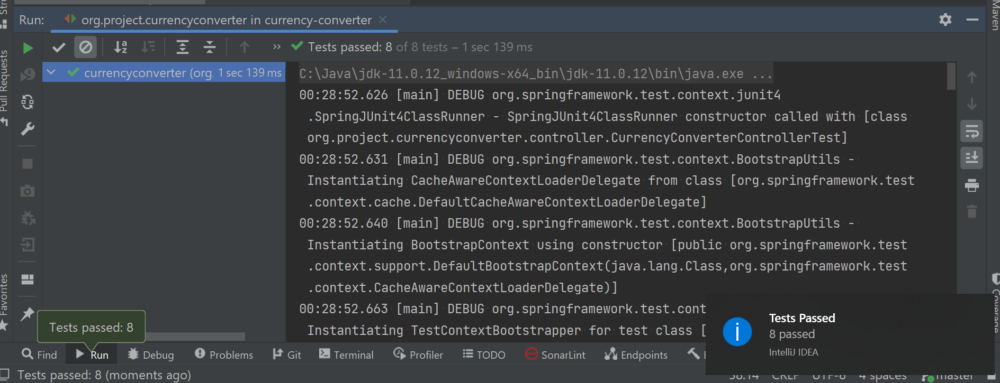

# Currency-converter service

## Prerequisites:

- java 8 or above is installed and it's PATH is configured in the system's environment variable settings
- maven is installed and it's PATH is also configured in the system's environment variable settings.

## Assumptions:

- This is the back-end service that means you can run by Postman.
- For simplicity, security is not implemented yet.
- In order to make it simple enough, currency localization is limited to first value in "Accept-header" in the 
  convert API. Visit http://localhost:8092 for the Swagger documentation.
- This API makes the converted amount to be readable by the user in human format given "Accept-header" is choosen as language(default en). If this API needs to be used by another API, small conversion from readable format with currency to number format is required by standard JAVA NumberFormat API.

## Build and Run:
- PMD plugin is integrated with maven for static code analysis and force the developers to maintain the code best
  practices at all times. In case it violates standard rules, it fails build.
- In order to build the project go to the root dir which is the same directory where you are viewing this file.
- go to the Terminal and type `mvn clean install` in order to start the build.
  Once completed, go to `org.project.currencyconverter.CurrencyConverterServiceApplication` and right click -> Run this application
  
  - Snapshots: 
    - Build: 
  
    - Junits:   
  
    - Postman documentation:    
      
    - convert API:  

    - Exchange API:  
  
     - Supported Symbols API:    
  
  
### Other Considerations:
Please make sure no servers are running as this applications uses below ports :   
- `8092: currency-converter-service`  
- In case you want to change the port, you can change the port from application.properties.  
- maven `settings.xml` - contains no proxy or anything, example:

    `<settings xmlns="http://maven.apache.org/SETTINGS/1.0.0"  xmlns:xsi="http://www.w3.org/2001/XMLSchema-instance"  xsi:schemaLocation="http://maven.apache.org/SETTINGS/1.0.0                      http://maven.apache.org/xsd/settings-1.0.0.xsd">
	<localRepository/>
	<interactiveMode/>
	<usePluginRegistry/>
	<offline/>
	<pluginGroups/>
	<proxies>
    </proxies>
	<servers>
    </servers>
	<mirrors>
	</mirrors>
	<profiles/>
	<activeProfiles/>
    </settings>`
